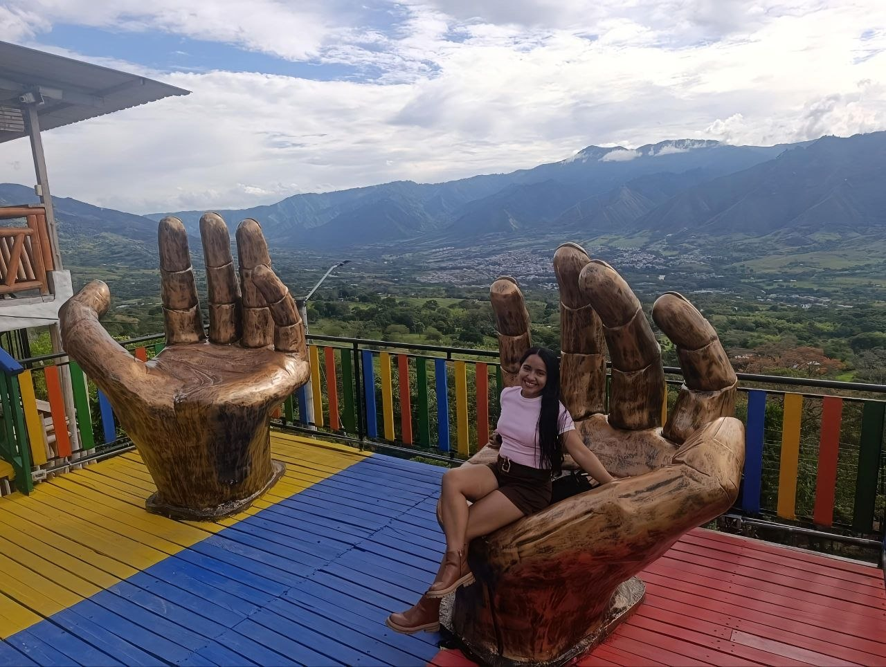

# Game4Impact

Repositorio del proyecto colaborativo del curso **Programación para Videojuegos – UNAD**  
Etapa 1: Reconocimiento del entorno y armado de equipos con SCV

---

## 👩‍💻 Perfil del equipo

### Allison Michelle Rodríguez Valencia
- 📍 Ubicación: La Plata, Huila  
- 🎭 Rol: Diseñadora de juego (asumiendo todos los roles del equipo)  
- ✨ Perfil breve: Estudiante apasionada por el desarrollo de videojuegos con propósito social, enfocada en unir creatividad y tecnología para generar impacto positivo.  

---

## 🍽️ Imagen de mi plato favorito
Dentro de la carpeta **Allison** se incluye la imagen de mi plato favorito (*pescado asado*).

---

## 📌 Propósito del repositorio 

Este repositorio se utiliza para:
- Practicar el uso de **GitHub** como sistema de control de versiones.  
- Documentar el trabajo colaborativo del curso.  
- Consolidar análisis de videojuegos con propósito social (*games for change*).  
- Evidenciar participación individual mediante commits y ramas personales.  

---

## 🏷️ Versión
Tag inicial: **v1.0**
# Game4Impact
Repositorio del proyecto colaborativo de Programación para Videojuegos – UNAD.
